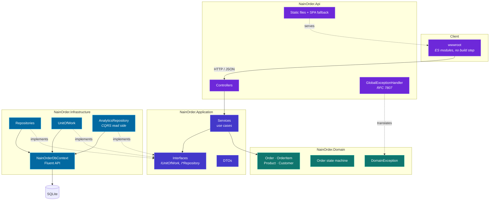
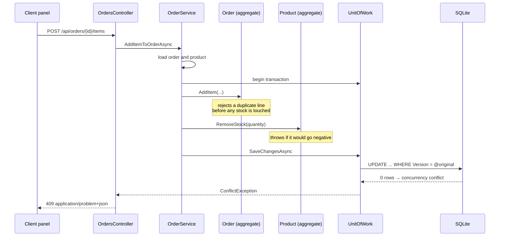

# Architecture

**Status:** Draft — pending owner approval

## Layers

Four projects. Every dependency points inwards, towards the domain.

`NainOrder.Domain` references no NuGet package at all. That is the load-bearing constraint: it is
what allows the business rules to be tested without a database, a web host or a container, and it is
what stops persistence concerns from leaking into the model.

## Request path

A single write request crosses every layer and returns through the same boundary:

The failure branch is drawn on purpose: it is the path that distinguishes this design from one where
the stock check and the stock write are not the same operation.

## Cross-cutting decisions

| Concern | Where it lives | Why there |
| :--- | :--- | :--- |
| Transactional boundary | `IUnitOfWork`, owned by the use case | Adding a line mutates two aggregates; only the use case knows they must commit together |
| Error contract | `GlobalExceptionHandler` | One place decides status codes, so controllers carry no `try/catch` and a technical fault cannot be masked as a `400` |
| Money representation | `MoneyConverter` in Infrastructure | It is a storage concern; the domain keeps working in `decimal` |
| Read model | `AnalyticsRepository` | Aggregation runs in SQL over integer cents; materialising aggregates to sum them would not scale |
| Allowed transitions | `Order.TransitionsFrom` | Published verbatim at `/api/meta/order-state-machine` so the client cannot drift from the rule |

## Client panel

`NainOrder.Api/wwwroot` is served by the same origin as the API: no CORS, no build step, no Node in
the deployment. It renders and captures input only. Every derived figure — totals, stock status, the
buttons a given order may offer — comes from the API response. The panel never re-implements a rule.

An unknown route under `/api` or `/swagger` returns `404` as `application/problem+json`; only routes
outside those prefixes fall through to the panel's own router.

## Related decisions

- [ADR-0001](30-decisions/ADR-0001-money-as-integer-cents.md) — money as integer cents
- [ADR-0002](30-decisions/ADR-0002-optimistic-concurrency-on-stock.md) — optimistic concurrency
- [ADR-0003](30-decisions/ADR-0003-unit-of-work-owns-the-transaction.md) — unit of work
- [ADR-0004](30-decisions/ADR-0004-materialised-order-totals.md) — materialised totals
- [ADR-0005](30-decisions/ADR-0005-problem-details-error-contract.md) — error contract
- [ADR-0006](30-decisions/ADR-0006-dependency-free-client-panel.md) — dependency-free panel
