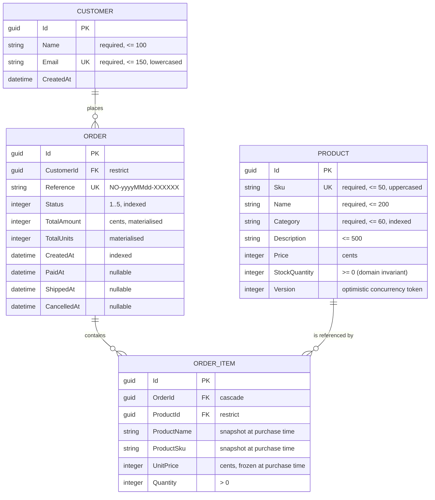

# Data model

**Status:** Draft — pending owner approval · in sync with migration `InitialSchema`

## Entities

## Notes that are not visible in the diagram

**Money is stored as integer cents, never `decimal`.** SQLite has no decimal type; EF Core would
persist it as text, so `ORDER BY` and `SUM` would operate on strings and return wrong results. A
`ValueConverter` maps `decimal` to `INTEGER` at the boundary — see
[ADR-0001](30-decisions/ADR-0001-money-as-integer-cents.md). The domain never sees cents.

**`Product.Version` is a concurrency token.** Every mutation increments it and EF Core adds it to the
`WHERE` clause of the `UPDATE`. Two simultaneous reservations of the last unit cannot both succeed —
see [ADR-0002](30-decisions/ADR-0002-optimistic-concurrency-on-stock.md).

**`OrderItem` snapshots name, SKU and unit price.** A later price change in the catalogue must not
alter an order already issued. This is a domain rule, not a cache.

**`Order.TotalAmount` and `TotalUnits` are materialised**, recalculated by the aggregate on every
basket mutation. Listings and metrics aggregate them in SQL without loading any line — see
[ADR-0004](30-decisions/ADR-0004-materialised-order-totals.md).

**Every `Guid` primary key is `ValueGeneratedNever`.** The domain assigns identity in its
constructor; declaring it explicitly removes any ambiguity for EF Core between an `INSERT` and an
`UPDATE` when it discovers an entity through a navigation.

## Constraints enforced by the engine

| Constraint | Table | Purpose |
| :--- | :--- | :--- |
| `UNIQUE (Sku)` | Products | A SKU identifies exactly one catalogue entry |
| `UNIQUE (Email)` | Customers | Email is the customer's natural key |
| `UNIQUE (Reference)` | Orders | The reference is what a customer quotes to support |
| `UNIQUE (OrderId, ProductId)` | OrderItems | A product cannot appear twice in one order — the rule lives in the domain and is reinforced here |
| `FK Orders → Customers` restrict | Orders | A customer with orders cannot be deleted silently |
| `FK OrderItems → Orders` cascade | OrderItems | Lines have no life of their own |
| `FK OrderItems → Products` restrict | OrderItems | A product referenced by an order stays referenceable |
